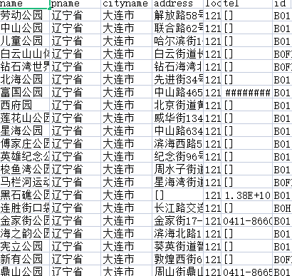

# get_amap_POI_data
下载高德地图webapi中的POI 
修改list1 = ['name','pname','cityname','address','location','tel','id']，即可指定获得的数据类型和顺序 
以列为类别写入csv 
需要https://lbs.amap.com/api/webservice/guide/api/search获取key并填入 
1.修复了一页不满20条出错的问题。现在，直到返回完全空白的页面才会出错。 
2.添加了限定页数最小值的方法。 

